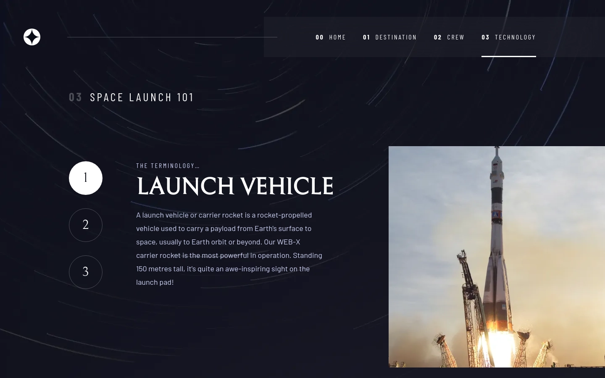

# Frontend Mentor | Space tourism multi-page website
This is my solution to the [Space tourism multi-page website challenge](https://www.frontendmentor.io/challenges/space-tourism-multipage-website-gRWj1URZ3) from [Frontend Mentor](https://www.frontendmentor.io/).

## Tech Stack
 - Angular
 - SCSS

## Developer Tools
 - VS Code
 - Figma

## Links
 - [Website](https://fem-space-tourism-multi-page-website-jgerard.vercel.app) hosted with [Vercel](https://vercel.com/)
 - Images served from [ImageKit](https://imagekit.io/) CDN
 - [Solution](https://www.frontendmentor.io/solutions/space-tourism-multipage-website-UHr5CG9m9M)

## Screenshots
### Home page
#### Desktop

#### Tablet

#### Mobile

### Destination page
#### Desktop

#### Tablet

#### Mobile

### Crew page
#### Desktop

#### Tablet

#### Mobile

### Technology page
#### Desktop

#### Tablet

#### Mobile

## About Frontend Mentor
[Frontend Mentor](https://www.frontendmentor.io/) challenges help you improve your coding skills by building realistic projects.

## Copyright
© 2023 Johnny Gérard
